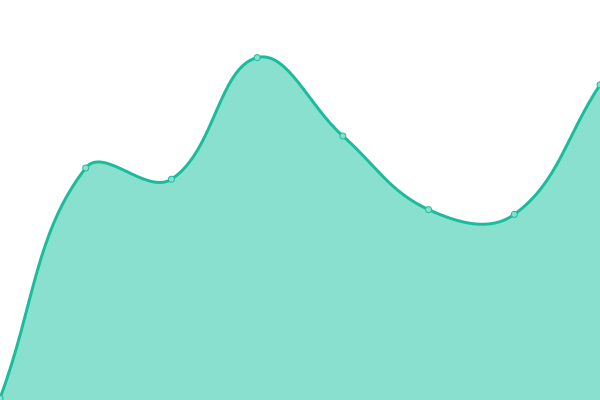
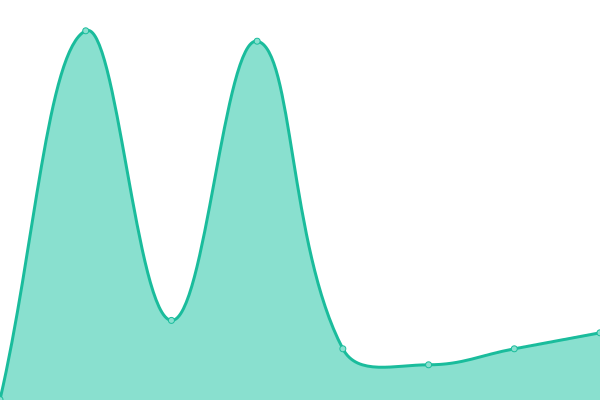
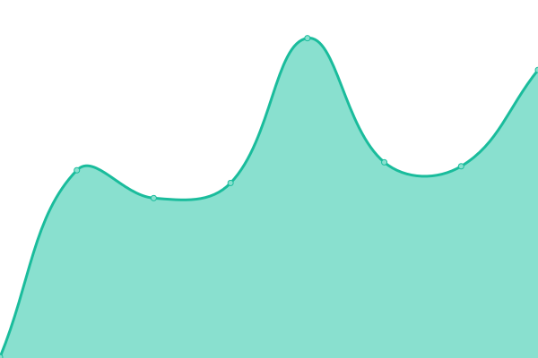
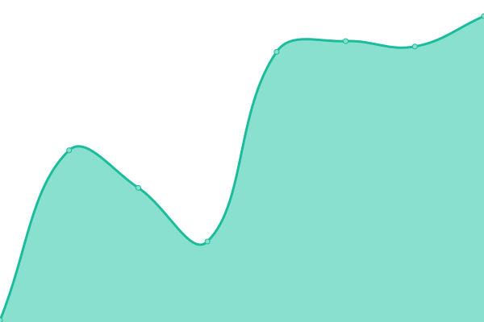

# [📈 Live Status](https://Ashless-network.github.io/uptime): <!--live status--> **🟥 Complete outage**

This repository contains the open-source uptime monitor and status page for [Ashless Network](https://Ashless-network.github.io/uptime), powered by [Upptime](https://github.com/upptime/upptime).

With [Upptime](https://upptime.js.org), you can get your own unlimited and free uptime monitor and status page, powered entirely by a GitHub repository. We use [Issues](https://github.com/Ashless-network/uptime/issues) as incident reports, [Actions](https://github.com/Ashless-network/uptime/actions) as uptime monitors, and [Pages](https://Ashless-network.github.io/uptime) for the status page.

<!--start: status pages-->
<!-- This summary is generated by Upptime (https://github.com/upptime/upptime) -->
<!-- Do not edit this manually, your changes will be overwritten -->
<!-- prettier-ignore -->
| URL | Status | History | Response Time | Uptime |
| --- | ------ | ------- | ------------- | ------ |
|  [Website](https://ashless.net) | 🟥 Down | [website.yml](https://github.com/Ashless-Network/upptime/commits/HEAD/history/website.yml) | 

 0ms
     
 | 

<a href="https://status.ashless.net/history/website">0.05%</a>
    

|  [Store](https://boutique.ashless.net) | 🟥 Down | [store.yml](https://github.com/Ashless-Network/upptime/commits/HEAD/history/store.yml) | 

 0ms
     
 | 

<a href="https://status.ashless.net/history/store">0.05%</a>
    

|  [Wiki](https://wiki.ashless.net) | 🟥 Down | [wiki.yml](https://github.com/Ashless-Network/upptime/commits/HEAD/history/wiki.yml) | 

 0ms
     
 | 

<a href="https://status.ashless.net/history/wiki">0.05%</a>
    

|  [API](https://api.ashless.net) | 🟥 Down | [api.yml](https://github.com/Ashless-Network/upptime/commits/HEAD/history/api.yml) | 

 48ms
     
 | 

<a href="https://status.ashless.net/history/api">0.05%</a>
    

|  [CDN (Content Devlivery Network)](https://cdn.ashless.net) | 🟥 Down | [cdn-content-devlivery-network.yml](https://github.com/Ashless-Network/upptime/commits/HEAD/history/cdn-content-devlivery-network.yml) | 

 295ms
     
 | 

<a href="https://status.ashless.net/history/cdn-content-devlivery-network">0.05%</a>
    

|  [Status](https://status.ashless.net) | 🟥 Down | [status.yml](https://github.com/Ashless-Network/upptime/commits/HEAD/history/status.yml) | 

 65ms
     
 | 

<a href="https://status.ashless.net/history/status">0.00%</a>
    

<!--end: status pages-->

[**Visit our status website →**](https://Ashless-network.github.io/uptime)

## 📄 License

- Powered by: [Upptime](https://github.com/upptime/upptime)
- Code: [MIT](./LICENSE) © [Ashless Network](https://Ashless-network.github.io/uptime)
- Data in the `./history` directory: [Open Database License](https://opendatacommons.org/licenses/odbl/1-0/)
